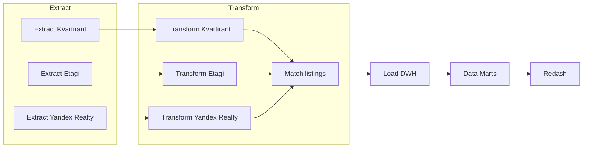
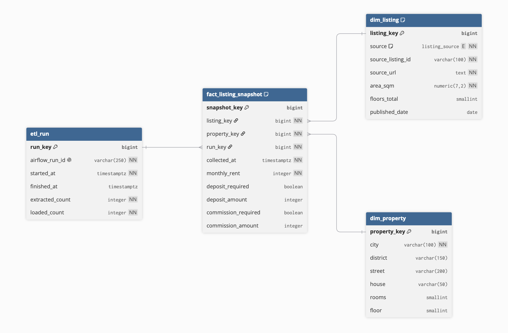
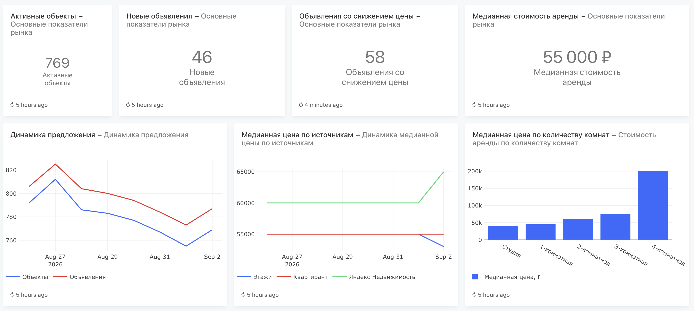
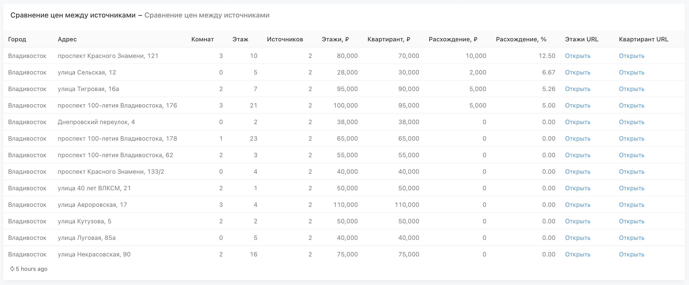

# Rental DWH

ETL-проект для сбора и анализа объявлений о долгосрочной аренде квартир во Владивостоке. Данные ежедневно собираются из трёх источников – «Этажи», «Квартирант» и «Яндекс Недвижимость». Данные приводятся к единому формату, сопоставляются между собой и загружаются в PostgreSQL. Для аналитики поверх хранилища создаются SQL-витрины, визуализируемые в Redash.

## Возможности проекта

- Ежедневный сбор объявлений из трёх независимых источников;
- Сохранение неизменённых RAW-снимков для повторной обработки;
- Нормализация адресов и характеристик квартир;
- Поиск одной квартиры на разных площадках;
- Хранение ежедневных снимков объявлений в DWH;
- Анализ цен, предложения, жизненного цикла объявлений и различий между источниками;
- Автоматизация ETL-процесса с помощью Apache Airflow;
- Локальный запуск отдельных этапов через Makefile;
- Визуализация аналитических витрин в Redash.

## Архитектура

Для каждого источника этапы Extract и Transform выполняются независимо. Поэтому три ветки пайплайна могут работать параллельно: Transform конкретного источника ожидает только завершения соответствующего Extract.

После подготовки всех данных общий этап Match listings находит объявления об одних и тех же квартирах. Затем объединённый набор загружается в DWH. Витрины создаются отдельным SQL-скриптом поверх таблиц хранилища и используются в Redash.



Airflow DAG `rental_etl` запускается ежедневно в 15:00 по часовому поясу `Europe/Moscow`. Автоматизированный DAG заканчивается этапом Load DWH; создание витрин из `sql/create_marts.sql` выполняется отдельно.

## Этапы процесса

### 1. Extract

Парсеры последовательно обходят страницы источников, извлекают карточки объявлений и исключают повторяющиеся URL внутри одного запуска. 

#### Форматы RAW-данных

RAW-снимки намеренно сохраняются в форматах, близких к представлению данных в источниках:

| Источник | Формат |
| --- | --- |
| «Этажи» | CSV |
| «Квартирант» | JSON |
| «Яндекс Недвижимость» | JSON |` |

Разноформатность RAW-слоя — одна из особенностей проекта. Она демонстрирует типичный сценарий хранилища данных, в котором сведения поступают из неоднородных систем.

### 2. Transform

Для каждого источника используется собственный преобразователь. Он читает RAW в исходном формате и приводит каждое объявление к единой структуре JSON:

| Поле | Тип | Описание |
| --- | --- | --- |
| `source` | `string` | Код источника: `etagi`, `kvartirant` или `yandex_realty` |
| `source_listing_id` | `string` | Идентификатор объявления на сайте источника |
| `source_url` | `string` | Ссылка на исходное объявление |
| `city` | `string` | Нормализованное название города |
| `district` | `string \| null` | Район города, если он указан источником |
| `street` | `string \| null` | Нормализованное название улицы |
| `house` | `string \| null` | Нормализованный номер дома |
| `rooms` | `integer \| null` | Количество комнат; `0` обозначает студию |
| `area_sqm` | `number \| null` | Общая площадь в квадратных метрах |
| `floor` | `integer \| null` | Этаж квартиры |
| `floors_total` | `integer \| null` | Количество этажей в доме |
| `monthly_rent` | `integer \| null` | Стоимость аренды в рублях за месяц |
| `deposit_required` | `boolean \| null` | Требуется ли залог |
| `deposit_amount` | `integer \| null` | Размер залога в рублях |
| `commission_required` | `boolean \| null` | Требуется ли комиссия |
| `commission_amount` | `integer \| null` | Размер комиссии в рублях |
| `published_date` | `string \| null` | Дата публикации в формате `YYYY-MM-DD` |
| `collected_at` | `string` | Дата и время сбора в формате ISO 8601 с часовым поясом |

Значение `null` означает, что источник не предоставляет поле или его не удалось определить.

На этом же этапе нормализуются названия улиц, номера домов и текстовые значения. 

### 3. Match listings

Объявления разных источников сравниваются по адресу, количеству комнат, этажу, площади и цене. Площадь может отличаться не более чем на 2 м², а цена — не более чем на 7%. Найденные связи объединяются в группы, соответствующие одной квартире.

### 4. Load DWH

#### Модель данных

Хранилище состоит из двух измерений, таблицы фактов и технической таблицы запусков:

- `dim_property` — физические квартиры;
- `dim_listing` — объявления на конкретных площадках;
- `fact_listing_snapshot` — ежедневные состояния объявлений;
- `etl_run` — метаданные запусков ETL.

Загрузка выполняется в PostgreSQL одной транзакцией. Объявления добавляются или обновляются в измерении `dim_listing`, квартиры — в `dim_property`, а каждое наблюдение записывается в таблицу фактов `fact_listing_snapshot`.

Таблица `etl_run` хранит техническую информацию о запуске: идентификатор Airflow, время начала и завершения, количество извлечённых и загруженных строк. За счёт ежедневных снимков сохраняется история стоимости и доступности каждого объявления.

#### ER-диаграмма



### 5. Аналитические витрины

Скрипт `sql/create_marts.sql` создаёт четыре представления:

- `marts.market_daily` — ежедневные показатели рынка по городу и количеству комнат;
- `marts.source_daily` — предложение, новые объявления и цены по источникам;
- `marts.listing_lifecycle` — срок наблюдения и история изменения цены каждого объявления;
- `marts.cross_source_properties` — квартиры, найденные одновременно на нескольких площадках, и разница цен между ними.

#### Дашборд

Redash подключается к PostgreSQL с аналитическими витринами и используется для визуализации состояния рынка, динамики цен и сравнения источников.




Запросы Redash обновляются ежедневно в 15:15 по московскому времени — после завершения ETL-пайплайна, который запускается в 15:00.

## Структура проекта

```text
.
├── dags/                       # Airflow DAG
├── data/
│   ├── raw/                    # исходные снимки источников
│   └── processed/              # нормализованные данные и match-группы
├── docs/
│   ├── images/                 # ERD и скриншоты дашборда
│   └── schema.dbml             # схема для dbdiagram.io
├── logs/                       # логи парсеров и Airflow
├── redash/                     # Docker Compose и окружение Redash
├── sql/
│   └── create_marts.sql        # аналитические представления
├── src/rental_dwh/
│   ├── extract/                # сбор и сохранение RAW
│   ├── transform/              # очистка, унификация и сопоставление
│   ├── load/                   # схема и загрузка PostgreSQL
│   └── utils/                  # общие вспомогательные модули
├── docker-compose.yaml         # Airflow, PostgreSQL и Redis
├── Dockerfile                  # образ Airflow с пакетом проекта
├── Makefile                    # ручной запуск отдельных этапов
└── pyproject.toml              # метаданные и Python-зависимости
```

## Работа проекта

Проект можно запускать двумя способами: как автоматизированный ETL-пайплайн в Docker или поэтапно локально через Makefile.

### Docker и Airflow

Основной `docker-compose.yaml` поднимает всю инфраструктуру, необходимую для выполнения ETL:

- Apache Airflow управляет расписанием и зависимостями между задачами, позволяя параллельно обрабатывать данные из трёх источников;
- Служебный PostgreSQL хранит метаданные Airflow;
- Отдельный PostgreSQL используется как целевое хранилище Rental DWH.

Airflow запускает DAG `rental_etl` каждый день в 15:00 по московскому времени. Сбор и преобразование данных трёх источников выполняются параллельно. Когда все ветки завершены, запускаются сопоставление объявлений и загрузка результата в DWH.

Интерфейс Airflow доступен на <http://localhost:8080>, а база DWH — на `localhost:5433`.

Аналитические витрины создаются поверх загруженных таблиц отдельным SQL-скриптом.

Redash работает в отдельном Compose-стеке, подключается к общей Docker-сети и читает подготовленные витрины.

Интерфейс Redash доступен на <http://localhost:5001>.

### Локальный запуск через Makefile

Makefile позволяет запускать Extract, Transform, Match и Load по отдельности, без запуска DAG. Такой режим используется для разработки, проверки отдельных стадий и повторной обработки сохранённых файлов.

Доступные команды:

```bash
make extract_etagi
make extract_kvartirant
make extract_yandex_realty

make transform_etagi
make transform_kvartirant
make transform_yandex_realty

make match_listings
make load_dwh
```

По умолчанию Transform, Match и Load работают с файлами за текущую дату. Для обработки файлов за другую дату можно передать переменную `DATE`:

```bash
make transform_etagi DATE=2026-09-02
make transform_kvartirant DATE=2026-09-02
make transform_yandex_realty DATE=2026-09-02
make match_listings DATE=2026-09-02
make load_dwh DATE=2026-09-02
```

При локальном запуске `load_dwh` подключается к PostgreSQL на `localhost:5433`. Адрес и реквизиты подключения при необходимости переопределяются переменными окружения.

## Перспективы развития

Первостепенные задачи:

- Покрыть код тестами;
- Реализовать обработку ошибок, валидацию данных и диагностику неуспешных записей;
- Настроить обработку HTTP-ошибок, таймаутов и разрывов соединения, а также повторные попытки выполнения задач при временных сбоях;
  
Второстепенные задачи:

- Добавить обнаружение капчи, логирование и уведомление о необходимости вмешательства;
- Добавить единый интерфейс для повторного запуска Transform, Match и Load за выбранную прошедшую дату без повторного Extract;
- Изолировать ветки источников так, чтобы ошибка одного источника не прерывала обработку остальных, а уже собранные RAW-данные сохранялись и могли быть обработаны позднее.
